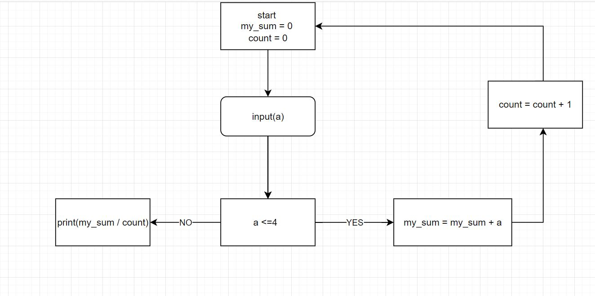

# Мой первый проект 1

## Преподователь + я

**Николай**

*Николай*
q
> Вот это цитата
>> А это цитата второго уровня и первого 

<<<<<<< HEAD
1. Доработать инструкцию + новое добавление
2. Сделать картинку git status
=======
1. Доработать инструкцию
2. Сделать картинку git status + тут тоже появилась новая инфа
>>>>>>> new_homewor4
3. Сделать картинку git log

[Пример](https://gist.github.com/Jekins/2bf2d0638163f1294637#Parag)

Добавил инфу через GitHub

